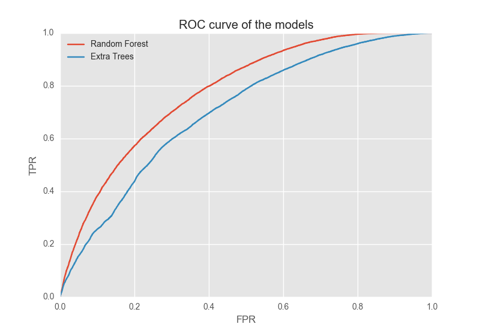
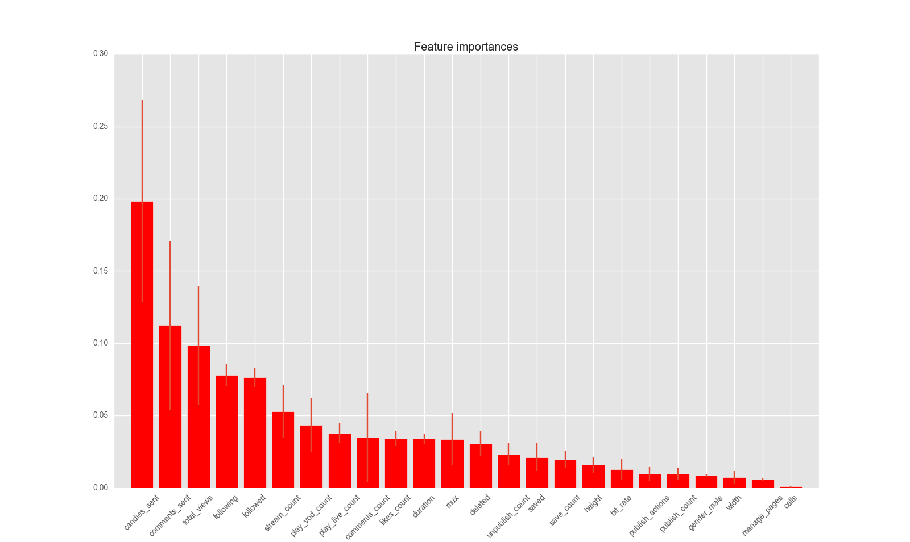

#Work in Progress

## Streamago Churn Prediction
Using data science algorithms in order to predict churn of Streamago application.

i. Contents
+ [What is Streamago?](#streamago)
+ [Motivation](#motivation)
+ [Data](#data)
+ [Pipeline](#pipeline)
+ [Data Exploration](#data_exploration)
+ [Models comparison](#model_comparison)
+ [Graph Algorithm](#graph_algorithm)
+ [Result](#result)
+ [Note](#note)

###  What is Streamago?
Live video streaming selfies app Streamago is an emerging startup of live streaming videos. Streamago lets you interact with your close friends and to meet new ones. Users can comment and like live streams in real time. It is also possible to follow your friends and do not miss a video.

###  Motivation
Churn prediction helps the app growth. In fact, is possible to improve user retention targeting users that might churn using push notifications or rewards. Moreover, in order to produce a churn prediction model it is necessary to explore the features and so it is possible to understand are the most important. This is a precious information and help to understand what users love about the app.

###  Data
Data is stored in a postgres database and in .csv files. In the database there are 2 tables, one includes users and the other streams information. In the .csv files there are information called stream impressions which include actions of users while watching a video. In the end, they provided me also a directed graph stored in a .csv file with the information of the Streamago's social network.

###  What is Churn?
Generally speaking, churn is a user of a service which left the service for a given time period. In this case churn was defined following the suggestion of the analytics team of Streamago: a person that do not use the app for 7-14 days.

###  Pipeline
Below, it is represented the pipeline of my study.

###  Data Exploration | Feature engineering
The data was explored and a first selection of features was made reading their values and if a feature had less 2 unique values it was ignored. Afterwards, new features were produced and in the end a  Below, there are showed some of plots that helped during the features selection process.

The *total_views* violin plot shows the higher number of views for users that did not churn which means predictive power.

From the *publish_actions* bar plot it is noticeable how users that churn tend to publish less actions compare to users that do not churn.

Similar to *total_views*, the violin plot of *comments_count* shows that users that won't churn have higher numbers of comments.

###  Models Comparison
Two model were compared: the Random forest and the Extra trees model. The comparison, was made first doing a random search of the best hyper-parameters of each model and then comparing the output through a ROC curve. The ROC curve shows that the Random Forest model outperformed the Extra trees model, thus Random Forest is our first choice.

We need also to decide which FPR we need. A rate around 55% is the best choice for our model because is the point where the curve slope start to decrease. Thus, the threshold chosen is 0.454 which means that each users that have a probability to churn higher than 0.454 is labeled as churn.

###  Feature importances

Here, is showed the feature importances of the random forest. As you can see the most important features are related to the activity of the user.
The other important features are the feature related to the type of the device and quality of the network like: width and height of the screen, and bit rate of the network.

###  Result
Finally, we can test our final model on the test set which is not used on the previous steps. The recall obtained on the test set is 0.55 and a precision of 0.6.

###  Comments
This result
This is the initial study for a more accurate churn prediction model are necessary
