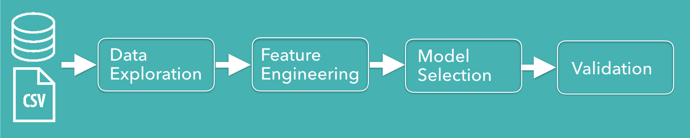
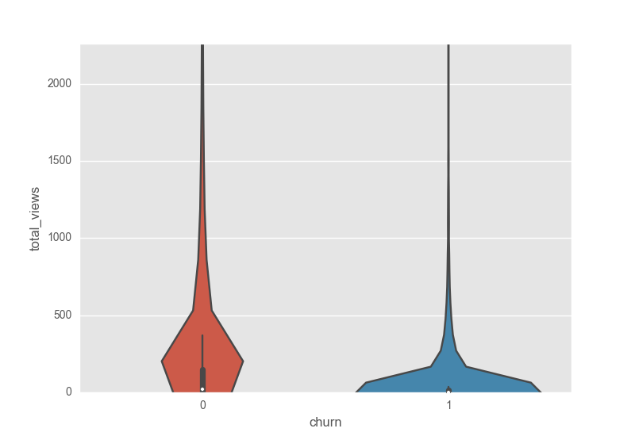
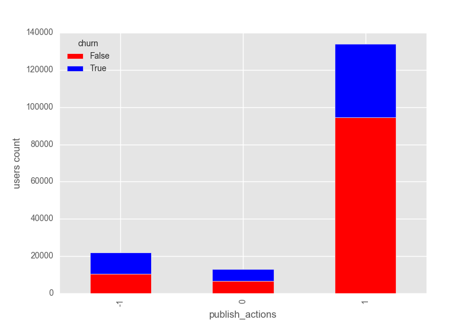
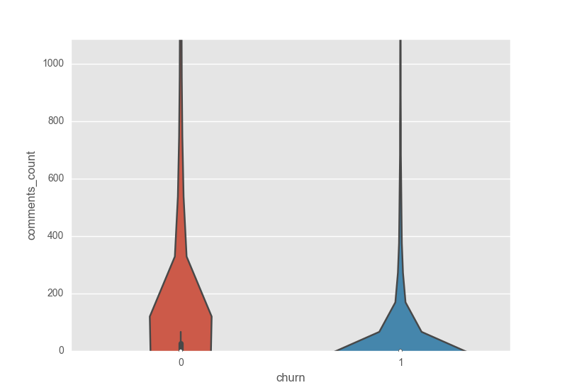

#Work in Progress

## Streamago Churn Prediction
Using data science algorithms in order to predict churn of Streamago application.

i. Contents
+ [What is Streamago?](#streamago)
+ [Motivation](#motivation)
+ [Data](#data)
+ [Pipeline](#pipeline)
+ [Data Exploration](#data_exploration)
+ [Models comparison](#model_comparison)
+ [Graph Algorithm](#graph_algorithm)
+ [Result](#result)
+ [Note](#note)

###  What is Streamago?
Live video streaming selfies app Streamago is an emerging startup of live streaming videos. Streamago lets you interact with your close friends and to meet new ones. Users can comment and like live streams in real time. It is also possible to follow your friends and do not miss a video.

###  Motivation
Churn prediction help the organic growth targeting users that might churn using push notifications or rewards. Moreover, in order to produce a churn prediction model it is necessary to understand which features are the most important. This is a precious information and help to understand what users love about the app.

###  Data
Data is stored in a postgres database and in .csv files. In the database there are 2 tables, one includes users and the other streams information. In the .csv files there are information called stream impressions which include actions of users while watching a video. In the end, they provided me also a directed graph stored in a .csv file with the information of the Streamago's social network.

###  What is Churn?
Generally speaking, churn is a user of a service which left the service for a given time period. In this case churn was defined following the suggestion of the analytics team of Streamago: a person that do not use the app for 7-14 days.

###  Pipeline
Below, it is represented the pipeline of my study.

###  Data Exploration
The data was explored and a first selection of features was made plotting each feature. Below, there are showed some of plots that helped during the features selection process.

The *total_views* violin plot shows the higher number of views for users that did not churn which means predictive power.

From the *publish_actions* bar plot it is noticeable how users that churn tend to publish less actions compare to users that do not churn.

Similar to *total_views*, the violin plot of *comments_count* shows that users that won't churn have higher numbers of comments.

###  Models Comparison
Models comparison has followed this pipeline

here you can see the

###  Result

###  Note
